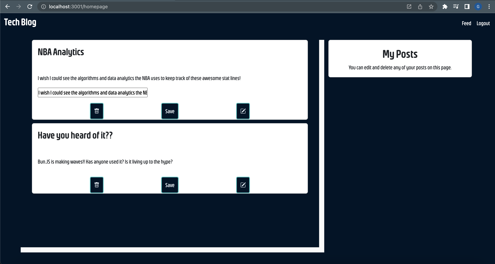

# Tech Blog - Model-View-Controller(MVC)

A blog site where developers and tech lovers can publish their blog posts, read others posts and update & delete their own posts. The site requires user authentication for access.

---

## License


---

## Table of Contents:

- [License](#license)
- [Technologies](#technologies)
- [Installation](#installation)
- [Application](#application)
- [Contact](#contact)

---

## Technologies:

- Node
- JavaScript
- mySQL
- Handlebars.Js
- Express.Js
- Bootstrap

---

## Installation

- This is a Node.Js based application. If not using the Heroku link please follow the instructions to get the application running on your server.

1. Clone repo from GitHub

   ```
   gh repo clone geoescobar/tech-blog
   ```

2. In the .env file, update the required information to connect to mySQL

   ```diff
   DB_NAME=blog_db
   -DB_PASSWORD=  YOUR PASSWORD HERE
   DB_USER= root
   ```

3. Run your schema database in the db folder (If you don't have pw ignore the -p)

   ```
   mysql -u root -p
   password: YOUR PASSWORD HERE
   source schema.sql
   ```

4. Back in the main terminal seed the database

   ```
   npm run seed
   ```

5. Launch application
   ```
   npm start || node server.js
   ```

---

## Application

#### [Github Repo](https://github.com/geoescobar/tech-blog)


#### [Demo](https://ge-tech-blog.herokuapp.com/)




---

## Contact

#### If you have any questions about this repo or want to send a message my contact info is below!

- https://github.com/geoescobar
- geo.escobar214@gmail.com
